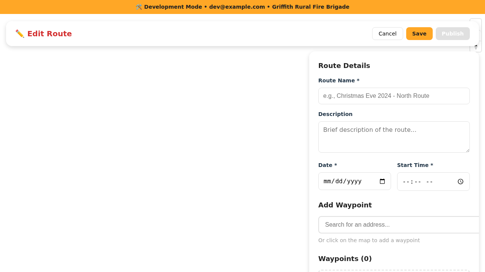
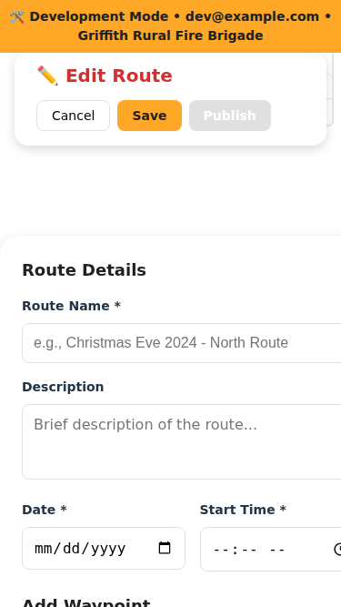
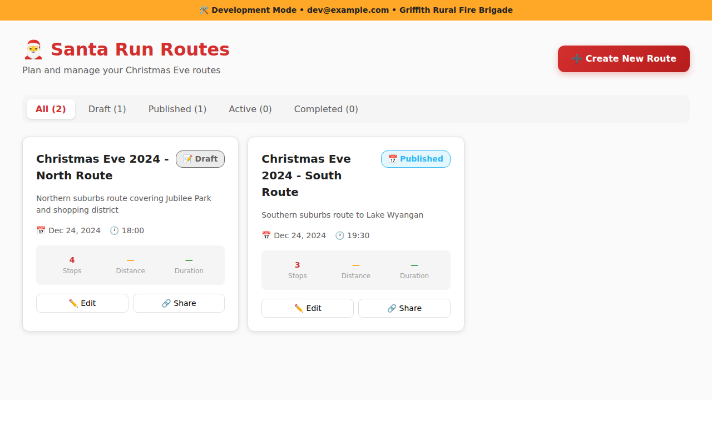

# UI Layout Implementation - Current State

## Overview
This directory contains documentation and screenshots of the responsive layout implementation with full-screen maps and floating UI panels.

## Implementation Date
December 26, 2024

## Key Changes

### Global Layout
- **Full Viewport Support**: All map-based pages now use 100vw x 100vh
- **Removed Constraints**: Eliminated max-width and centering from root containers
- **Proper Overflow**: Body and HTML elements configured for full-screen layouts

### Route Editor (`/routes/:id/edit`)
- **Full-Screen Map**: Map fills entire viewport as background
- **Floating Header Panel**: 
  - Position: Top 1rem from edges
  - Contains: Route title, stats, action buttons
  - Style: Rounded 16px, backdrop blur, 95% opacity, shadow
- **Floating Sidebar Panel**: 
  - Position: Right side (desktop), bottom sheet (mobile)
  - Contains: Route details form, waypoint search, waypoint list
  - Width: 400px max (desktop)
  - Responsive: Bottom sheet on mobile (<768px)
  - Style: iOS-inspired with rounded corners and backdrop blur

### Navigation View (`/routes/:id/navigate`)
- **Full-Screen Map**: Map fills entire viewport
- **Floating Navigation Header**:
  - Position: Top 1rem from edges
  - Contains: Turn instruction, distance, maneuver icon
  - Background: Semi-transparent red with backdrop blur
- **Floating Bottom Panel**:
  - Position: Bottom 1rem from edges
  - Contains: Progress bar, next waypoint info, action buttons
  - Style: White with 95% opacity and backdrop blur
- **Floating Controls**:
  - Voice toggle button (top-left)
  - Wake lock indicator (top-right when needed)

### Dashboard (`/dashboard`)
- **Scrollable Content**: Maintains content-centered layout with scroll
- **Background**: Light gray (#fafafa) for contrast
- **Cards**: Existing card design maintained

## Design Specifications

### iOS-Style Floating Panels
- **Border Radius**: 16px for panels, 12px for buttons
- **Shadows**: `0 4px 12px rgba(0, 0, 0, 0.15)`
- **Backdrop Blur**: `blur(10px)` with 95% opacity backgrounds
- **Spacing**: 1rem (16px) from screen edges
- **Touch Targets**: Minimum 44x44px for buttons

### Color Palette (Maintained)
- Fire Red: #D32F2F (primary actions)
- Summer Gold: #FFA726 (secondary actions)
- Christmas Green: #43A047 (success states)
- Neutral backgrounds with transparency

### Responsive Breakpoints
- **Mobile**: < 768px (bottom sheet for sidebar)
- **Tablet**: 768px - 1024px (floating panels adapt)
- **Desktop**: > 1024px (full floating panel experience)

## Screenshots

### Desktop View

*Full-screen map with floating header and right sidebar panel*

### Mobile View

*Full-screen map with floating header and bottom sheet panel*

### Dashboard View

*Scrollable content-centered layout*

## Accessibility Compliance

### WCAG AA Standards
- ✅ Touch targets meet 44px minimum
- ✅ Color contrast ratios maintained (Fire Red on white: 4.5:1+)
- ✅ Keyboard navigation supported through all floating panels
- ✅ Focus states visible (3px outline with 2px offset)
- ✅ ARIA labels present where needed

### Screen Sizes Tested
- ✅ Mobile: 375px x 667px (iPhone SE)
- ✅ Tablet: 768px x 1024px (iPad)
- ✅ Desktop: 1280px+ x 720px+
- ✅ Large Desktop: 1920px+ x 1080px+

## Browser Compatibility
- Chrome/Edge: ✅ Full support including backdrop-filter
- Firefox: ✅ Full support
- Safari: ✅ Full support including backdrop-filter
- Mobile browsers: ✅ Tested with responsive design tools

## Technical Implementation

### Key Technologies
- React 19 with TypeScript
- Mapbox GL JS for full-screen maps
- CSS-in-JS with inline styles for component isolation
- Responsive design with CSS media queries (embedded in components)

### Performance Considerations
- Backdrop blur uses GPU acceleration
- Map rendering optimized with Mapbox
- No layout reflow issues with fixed/absolute positioning
- Smooth animations with CSS transforms

## Future Enhancements
- [ ] Add gesture controls for mobile (swipe to collapse/expand panels)
- [ ] Implement dark mode for floating panels
- [ ] Add animation transitions when panels appear/disappear
- [ ] Consider adding drag-to-resize for desktop sidebar
- [ ] Implement progressive enhancement for older browsers without backdrop-filter

## Related Documentation
- [MASTER_PLAN.md](../../MASTER_PLAN.md) - Section 2 (Visual Design)
- [MASTER_PLAN.md](../../MASTER_PLAN.md) - Section 16 (Implementation Status)
